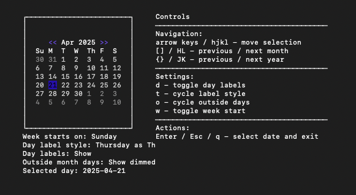

# Brick Calendar



A calendar widget for [Brick](https://github.com/jtdaugherty/brick) terminal user interfaces.

## Features

- Configurable first day of week (Sunday, Monday, etc.)
- Configurable day-of-week label
  - Single char (S, M, T, W, T, F, S)
  - Double char (Su, Mo, Tu, We, Th, Fr, Sa)
  - Distinct initials (Su, M, T, W, Th, F, S)
  - Hidden
- Option to show/hide/dim days outside the current month
- Easy integration with existing Brick applications

## Installation

```
cabal install brick-calendar
```

## Usage

```haskell
import Brick
import Brick.Widgets.Calendar
import Data.Time

-- Get today's date
today <- utctDay <$> getCurrentTime

-- Create a month calendar with default configuration
let monthWidget = monthCalendar today

-- Create a calendar with custom settings
customCalendar <- do
  today <- utctDay <$> getCurrentTime
  let settings = defaultCalendarConfig 
        { _weekStart = Monday                 -- Start week on Monday
        , _dayLabelStyle = DistinctInitials   -- Uses distinct initials (Th, Su)
        , _showDayLabels = True               -- Show day labels
        , _outsideMonthDisplay = ShowDimmed   -- Show days outside month as dimmed
        }
  return $ monthCalendarWithConfig settings today
```
